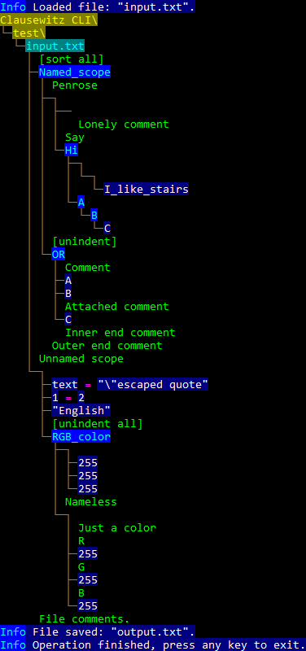

# Clausewitz interpreter
Helps with interpreting, reading, writing, editing and querying the contents of standard Clausewitz files made by Paradox Interactive for their various soft-coded games. This interpreter uses an abstract data tree structure when tokenizing Clausewitz files, and also offers pragma commands as sorting and indenting and enforces comment association, thus it could be used as a cleanup tool for messy projects that were already made around Clausewitz files.

**A prettyprint of an interpreted clausewitz file:**
 
 Source: **[Input.txt](Clausewitz%20CLI%2FTest%2FInput.txt)**

